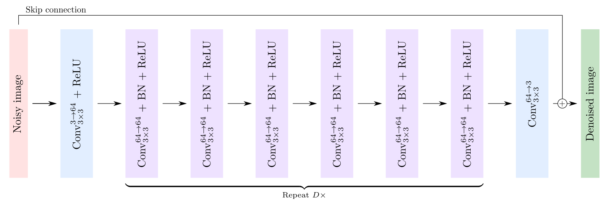
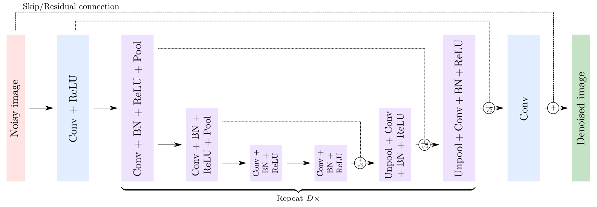
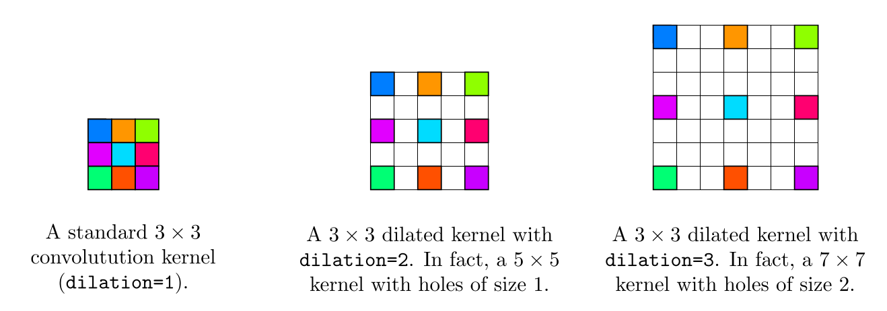

# Image-Denoising-with-Deep-CNNs

Use deep Convolutional Neural Networks (CNNs) with PyTorch, including investigating DnCNN and U-net architectures. More details in [`tutorial.ipynb`](src/tutorial.ipynb).

## Model Architecture

1. DnCNN



2. UDnCNN


3. DUDnCNN (Dilated U-shaped DnCNN)

Each convolution placed after `k` pooling and `l` unpooling in the network, should be replaced by a dilated filter with 2^(k−l) − 1 holes. This can be achieved with the dilation optional argument of `nn.Conv2d`. Make sure set up the argument padding accordingly to maintain tensors with the same spatial dimension during the forward propagation.



## Dataset

Images from [Berkeley Segmentation Dataset and Benchmark](https://www2.eecs.berkeley.edu/Research/Projects/CS/vision/bsds/).  

* Download here: [https://www2.eecs.berkeley.edu/Research/Projects/CS/vision/bsds/BSDS300-images.tgz](https://www2.eecs.berkeley.edu/Research/Projects/CS/vision/bsds/BSDS300-images.tgz)

It contains two sub-directories: `train` and `test`, which consist of 200 and 100 images, respectively, of either size `321 × 481` or `481 × 321`. While we saw that thousand to millions of images were required for image classification, we can use a much smaller training set for image denoising. This is because denoising each pixel of an image can be seen as one regression problem. Hence, our training is in fact composed of `200 × 321 × 481` **≈ 31 million** samples.

## Testing Environment  

* Pytorch version: `1.0.0`
* CUDA version: `9.0.176`
* Python version: `3.6.8`
* CPU: Intel(R) Xeon(R) CPU E5-2630 v4 @ 2.20GHz
* GPU: GeForce GTX 1080 Ti (11172MB GRAM)
* RAM: 32GB

## Usage

1. Clone this repository

```bash
git clone https://github.com/lychengr3x/Image-Denoising-with-Deep-CNNs.git
```

2. Download dataset

```bash
cd Image-Denoising-with-Deep-CNNs/dataset
wget https://www2.eecs.berkeley.edu/Research/Projects/CS/vision/bsds/BSDS300-images.tgz
tar xvzf BSDS300-images.tgz
rm BSDS300-images.tgz
```

3. Train the model

```bash
cd ../src
python main.py
```

**PS**: Read [`argument.py`](src/argument.py) to see what parameters that you can change.  

## Demonstration and tutorial

Please see [`demo.ipynb`](src/demo.ipynb) for demonstration, and [`tutorial.ipynb`](src/tutorial.ipynb) for tutorial.
